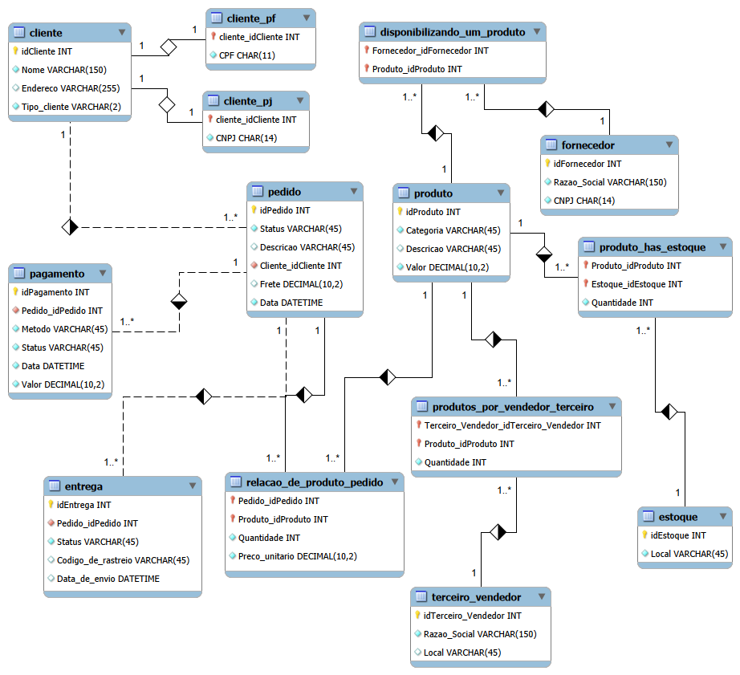

# Desafio: Refinamento de Modelo Relacional para E-commerce 🛒

Este repositório apresenta o desenvolvimento e o refinamento do esquema lógico para um sistema de E-commerce, aprimorado a partir de um modelo base para atender a requisitos de negócio específicos e complexos. O design e a arquitetura de dados foram implementados utilizando a ferramenta **MySQL Workbench**.

---

## 📖 Descrição Geral do Esquema

O esquema mapeia as operações essenciais de uma plataforma de comércio eletrônico, estruturado para garantir a integridade referencial, otimização de consultas e evitar a redundância de dados.

A arquitetura engloba os seguintes módulos funcionais:

* **Catálogo de Produtos:** Gerenciamento de itens por categoria, descrição e valor base.
* **Logística de Estoque e Fornecedores:** Controle de múltiplos centros de distribuição (`Estoque`) e o vínculo com `Fornecedores` tradicionais e vendedores parceiros (`Terceiro_Vendedor` / Marketplace) através de tabelas associativas (N:M).
* **Core Comercial (Pedido):** Centralização das vendas realizadas, contendo data de fechamento, descrição e o custo comercial do `Frete`.

---

## 📐 Diagrama Relacional de Dados

Para solucionar o desafio e mapear visualmente a nova arquitetura do banco de dados, o modelo foi estruturado conforme o diagrama abaixo:

---

## 🛠️ Refinamentos do Modelo (Requisitos do Desafio)

Para atender estritamente ao escopo proposto no desafio de projeto, foram aplicadas três modificações estruturais profundas no modelo original, focando em regras reais de negócio:

### 1. Especialização de Clientes (PJ e PF)

* **Regra de Negócio:** Uma conta de cliente pode ser Pessoa Jurídica (PJ) ou Pessoa Física (PF), mas nunca ambas simultaneamente.
* **Implementação Lógica:** Adotou-se o padrão de **Especialização/Generalização** (Herança). A tabela mãe `Cliente` centraliza os atributos comuns (Nome, Endereço e Tipo). Delas derivam-se as tabelas filhas `Cliente_PF` (CPF) e `Cliente_PJ` (CNPJ). Para garantir a integridade máxima do relacionamento 1:1 e ganho de performance em Joins, a Chave Estrangeira (FK) das tabelas filhas atua simultaneamente como a sua própria Chave Primária (PK), eliminando a necessidade de IDs genéricos adicionais e campos nulos (`NULL`) em massa.

### 2. Múltiplas Formas de Pagamento por Pedido

* **Regra de Negócio:** O cliente deve ter a flexibilidade de registrar mais de uma forma de pagamento para fechar um único pedido.
* **Implementação Lógica:** A entidade `Pagamento` foi totalmente desacoplada da tabela de pedidos, transformando-se em uma entidade independente. O relacionamento foi modelado como **1 para Muitos (1..*)** a partir de `Pedido`. Isso permite que uma única ordem de compra (`Pedido_idPedido`) aponte para múltiplas linhas de transação na tabela de pagamentos.

### 3. Gestão Logística da Entrega

* **Regra de Negócio:** Toda entrega associada a um pedido precisa conter, obrigatoriamente, um status de controle e um código de rastreamento.
* **Implementação Lógica:** Criou-se a entidade isolada `Entrega` para separar o fluxo comercial do fluxo logístico. Para preservar a cronologia correta do sistema (onde a entrega nasce após o fechamento do pedido), a Chave Estrangeira `Pedido_idPedido` foi inserida dentro da tabela `Entrega`, amarrando o rastreio diretamente à sua origem em uma relação estável de 1:1.

---

## 💻 Ferramentas e Paradigma

* **Paradigma:** Modelo Relacional (Estruturação de dados através de tabelas, chaves e restrições de integridade)
* **Ferramenta Utilizada:** MySQL Workbench
* **Notação Visual:** Representação por indicadores textuais de cardinalidade (ex: `1` e `1..*`)
