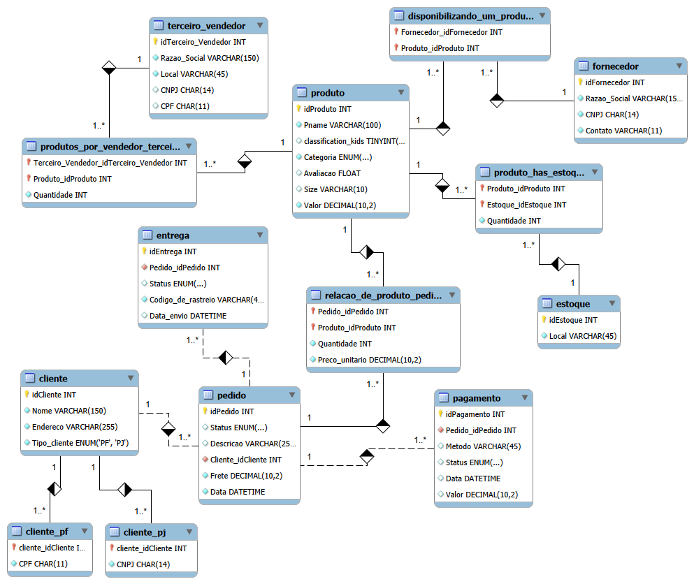

# Desafio: Refinamento de Modelo Relacional para E-commerce 🛒

Este repositório apresenta o desenvolvimento e o refinamento do esquema lógico para um sistema de E-commerce, aprimorado a partir de um modelo base para atender a requisitos de negócio específicos e complexos. O design e a arquitetura de dados foram implementados utilizando a ferramenta **MySQL Workbench**.

---

## 📖 Descrição Geral do Esquema

O esquema mapeia as operações essenciais de uma plataforma de comércio eletrônico, estruturado para garantir a integridade referencial, otimização de consultas e evitar a redundância de dados.

A arquitetura engloba os seguintes módulos funcionais:

* **Catálogo de Produtos:** Gerenciamento de itens por categoria, descrição e valor base.
* **Logística de Estoque e Fornecedores:** Controle de múltiplos centros de distribuição (`Estoque`) e o vínculo com `Fornecedores` tradicionais e vendedores parceiros (`Terceiro_Vendedor` / Marketplace) através de tabelas associativas (N:M).
* **Core Comercial (Pedido):** Centralização das vendas realizadas, contendo data de fechamento, descrição e o custo comercial do `Frete`.

---

## 📐 Diagrama Relacional de Dados

Para solucionar o desafio e mapear visualmente a nova arquitetura do banco de dados, o modelo foi estruturado conforme o diagrama abaixo:

---

## 🛠️ Refinamentos do Modelo (Regras de Negócio Implementadas)

Para atender ao escopo proposto e garantir a viabilidade analítica dos dados, foram aplicadas modificações estruturais profundas no modelo original:

### 1. Especialização de Clientes (PJ e PF)
* **Regra de Negócio:** Uma conta de cliente pode ser Pessoa Jurídica (PJ) ou Pessoa Física (PF), mas nunca ambas simultaneamente.
* **Implementação Lógica:** Adotou-se o padrão de **Especialização/Generalização** (Herança). A tabela mãe `Cliente` centraliza os atributos comuns. Delas derivam-se as tabelas filhas `Cliente_PF` (CPF) e `Cliente_PJ` (CNPJ). A Chave Estrangeira (FK) das tabelas filhas atua simultaneamente como a sua própria Chave Primária (PK), garantindo um relacionamento 1:1 perfeito, campos mandatórios únicos (`UNIQUE` e `NOT NULL`) e máxima performance em JOINs.

### 2. Múltiplas Formas de Pagamento por Pedido
* **Regra de Negócio:** O cliente deve ter a flexibilidade de parcelar ou utilizar mais de uma forma de pagamento para fechar um único pedido.
* **Implementação Lógica:** A entidade `Pagamento` foi totalmente desacoplada da tabela de pedidos. O relacionamento foi modelado como **1 para Muitos (1..*)** a partir de `Pedido`, permitindo múltiplas linhas de transação financeira para a mesma ordem de compra.

### 3. Preservação do Histórico Comercial (Foco em Data Science)
* **Regra de Negócio:** Alterações futuras nos preços dos produtos não podem corromper retroativamente o faturamento dos pedidos já concluídos no passado.
* **Implementação Lógica:** Aplicou-se uma desnormalização intencional na tabela associativa `Relacao_de_produto_pedido`, adicionando a coluna `Preco_unitario DECIMAL(10,2)`. No momento do fechamento da compra, a aplicação registra de forma imutável o preço vigente do produto, blindando os cálculos históricos de receita, LTV e margem de lucro contra distorções inflacionárias ou promocionais.

### 4. Gestão Logística e Fracionamento de Entregas
* **Regra de Negócio:** Um pedido pode ter seus itens despachados separadamente dependendo da disponibilidade em diferentes centros de distribuição ou parceiros comerciais (Marketplace).
* **Implementação Lógica:** Criou-se a entidade `Entrega` associada ao `Pedido` em uma relação de **1 para Muitos (1..*)**. Isso possibilita o rastreamento individualizado de sub-remessas vinculadas a um mesmo identificador de compra, contendo status logístico e códigos de rastreio independentes.

### 5. Otimização de Tipos de Dados
* Todos os campos temporais foram padronizados de strings para o tipo nativo `DATETIME` para permitir análise de séries temporais. Campos monetários foram blindados contra erros de arredondamento através do tipo de precisão fixa `DECIMAL(10,2)`.

---

## 💻 Ferramentas e Paradigma

* **Paradigma:** Modelo Relacional (Estruturação de dados através de tabelas, chaves e restrições de integridade)
* **Ferramenta Utilizada:** MySQL Workbench
* **Notação Visual:** Representação por indicadores textuais de cardinalidade (ex: `1` e `1..*`)
